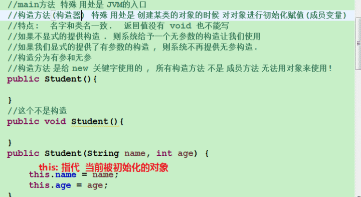
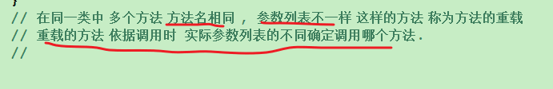
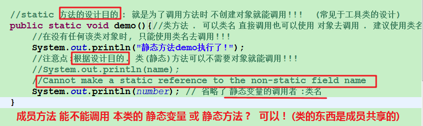
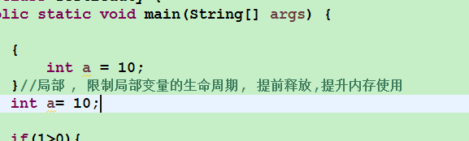
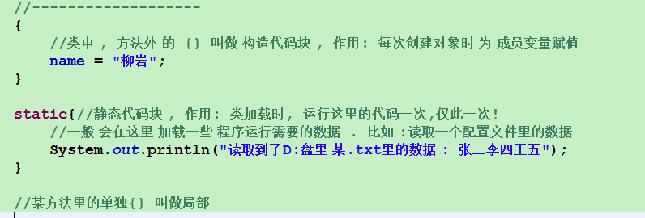
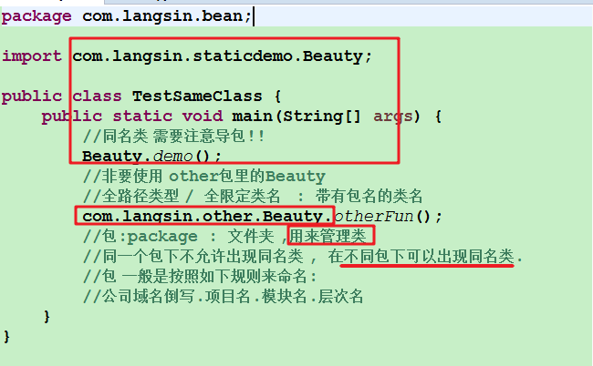
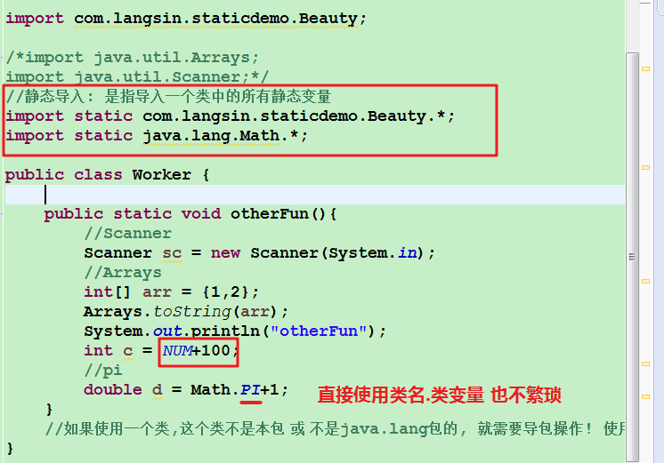
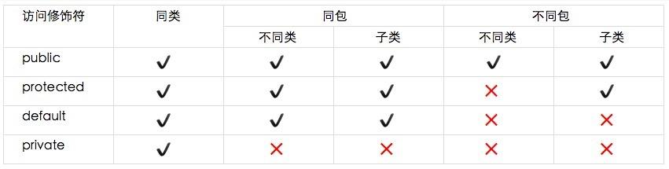

[Java内存:方法区详解](https://www.cnblogs.com/wangguoning/p/6109377.html)
# 递归方法
**递归方法就是方法调用自己。**
思想:将一个规模比较大的问题**逐渐转变为规模比较小的相似问题**,直到递归出口。
结构:
- 递归条件
- 逐步逼近
- 递归出口(基准条件)
~~~
    递归方法的应用场景较少,一个例子是文件系统中树的递归遍历方法.
    (当然ACM中应用递归方法的场景还是挺多的.)
~~~
# 方法
- **main方法**
    JVM虚拟机的入口.
- **构造方法**
    - 可用访问修饰符:*public,default,protected,private*.
    - 创建某类对象的时候对对象进行初始化赋值.
    - 名字和类名一致,分为有参和无参.
    - 不声明返回值,隐式返回构造器.
    - 不提供构造器,系统默认使用无参构造器构造器进行对象的初始化.
    - 显式提供构造器,系统不提供无参构造器构造器进行对象的初始化.
    - 构造方法是给*new*关键字使用的,**所有的构造方法不是*成员方法* ,无法用 *对象*         访问.**
> 
#### 方法的重载
- 在**同一个类**中**多个方法** **方法名**相同,参数却不一样,这样的方法称为方法的重载.
重载的方法依据调用时实际参数的不同来确定到底调用那个方法.
- 对比:方法的**重写**.

#### 方法的值传递问题
~~~java
class valueChuanDi{                             //值传递
    public void shouInt(int a,int b){
        int c=a;
        a=b;
        b=c;
        System.out.println("method:"+a)
        System.out.println("method:“+b)
    }

    public static void main(String[] args){
        int a=10,int b=10;
        Fun f=new fun();
        f.shouInt(a,b);
        System.out.println("Out of method:“+b)
        System.out.println("Out of method:“+b)
    }
}
~~~
**基本类型**的方法进行**值传递**,**引用类型**的方法只传递**引用**,既是*地址的复制*.
#### This指针
this指向当前对象,使用this.进行访问时可以访问当前对象的*成员变量*或*方法*.
1. **this**使用在*成员方法*中,指代当前调用方法对象(主调对象).
在同一类当中,this可以省略.**建议写上**.
2. **this**使用在*构造方法*中,可以引用本类的其他的*构造方法*,实现**代码的复用**.**(必须用在构造方法的首行去实现其他构造.)**
#### 变量的生命周期
+ 局部变量在栈内存当中.生命周期是作用域范围.
+ 成员变量在堆内存当中.生命周期由JVM的GC回收机制进行自动管理.
# 静态修饰符 static
- static:关键字,可以修饰变量/方法/类;
- 含义:静态:该类创建第一个对象之前.
- 动态:创建对象.
~~~java
static int number;
//类(静态)变量,属于图纸,属于所有该类对象共享.
~~~
1. 静态成员相当于**全局变量**,在任何时候都有效.
2. *static*修饰的玩意儿可以使用**类名**进行调用,也可以使用对象进行调用(**建议使用类名进行调用**).
3. *静态标识符*修饰的东西不需要*对象*就可以调用.而*普通方法*或*变量*必须依靠*对象*才能存在,因此被 *static*修饰的方法不能直接引用本类的成员.(内存可能都没有创建).
4. 但是方法可以引用*静态成员*,这不难理解.
5. **常用于工具类的设计**,**静态初始化块的使用**,**设计模式(工厂模式,单例模式,注册者模式等)**,**不创建对象就调用方法**的情况下.

# 初始化块
#### 在方法里(*):
+ 局部初始化块(不常用)

#### 在类中:
*初始化块*:类中代码块叫做构造代码块即**初始化块**,**每次创建对象的时候**优先执行,为成员变量赋值.
~~~java
class codebolock{
    int a,b;
    {
        a=1;
        b=2;
    }
}
~~~
*静态初始化块* **:类加载**时,运行,**仅此一次**.一般会在这里加载一些程序运行需要的数据,比如:读取一个配置文件里的数据.
~~~java
class codebolock{
    int a,b;
    static{
        a=1;
        b=2;
    }
}
~~~

加载顺序:静态初始化块>初始化块

> **思考**:与构造器一起加载,谁先执行?若类继承了父类,怎么执行？若存在祖父类?怎么执行?从根节点到本类的顺序到底是怎样的？
# 包与访问权限
#### package 包
- 包,*package*:文件夹,用来管理**类**.
- **同一个包**内**不可以**出现*同名类*.**不同**包里**可以**出现*同名类*.
- **同一个作用域**中使用已导入的同名类,使用**全路径类名**对*类*进行区分.
- *包的一般命名规则*:*公司域名*倒写.*项目名*.*模块名*.*层次名*

##### import *导包操作*
当要使用的类不属于**同包**下或者不属于**java.lang包**内时,需要*导包操作*.
- **导入:** *import*
    导入包中**所有***类*.
- **静态导入** *static import*
    导入包中**所有***静态成员*.
    
#### 访问权限
- **访问修饰符**
  - public
  - private
  - protected
  - private
- *访问修饰符*的**访问权限**
